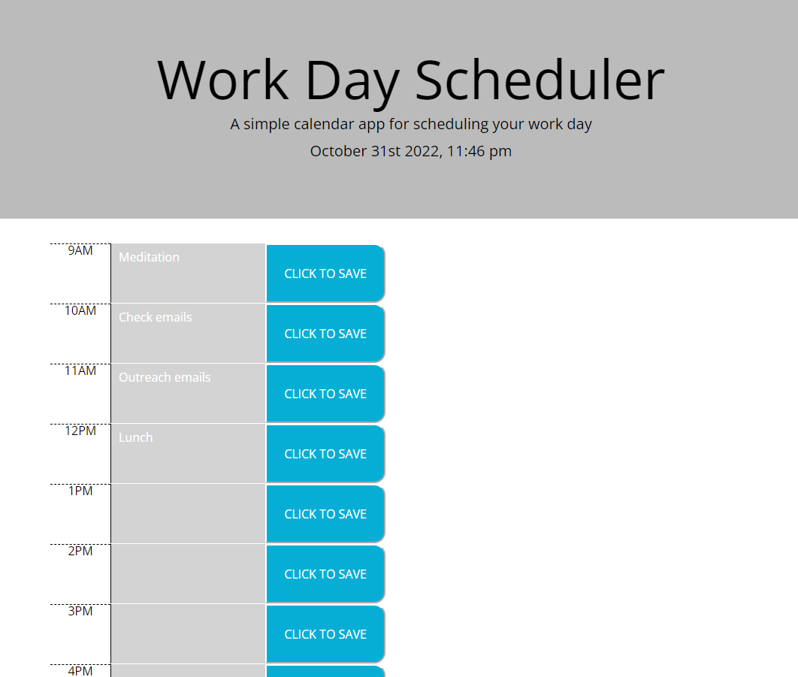

# Workday Scheduler
## Description

The primary goal of this project is to create an app for scheduling tasks throughout the workday. The color changes relative to the current time to indicate which time block the user is currently in.

In this project, I utilized moment.js, Bootstrap, saving and retrieving key/value pairs from local storage, functions dealing with time, and other Javascript methods and practically applied them to a functional app

## Installation

You can open the webpage in your web browser using this URL: 

## Usage
Features implemented on this webpage:
* Color changes relative to the current time, and it is color coded to indicate whether the time block is in the past, present, or future
* The current date and time of the user is displayed at the top of the schedule
* Text can be entered in the text box for each corresponding time block
* When the save button is clicked, the user input text will be saved. An alert will also display notifying the user that their text input has been saved successfully.
* When page is refreshed or re-loaded, the saved text that the user has entered is displayed where they entered the text

## Credits
Referenced the following resources to complete this project:
* https://stackoverflow.com/questions/62904905/how-do-i-color-code-time-blocks-using-js
* https://bobbyhadz.com/blog/javascript-typeerror-foreach-is-not-a-function#:~:text=The%20%22forEach%20is%20not%20a,arrays%2C%20Map%20or%20Set%20objects.
* https://stackoverflow.com/questions/70546999/trying-to-use-localstorage-to-store-user-inputted-text-in-textarea-but-save-and
* https://www.folkstalk.com/tech/add-event-listener-to-multiple-buttons-with-the-same-class-with-code-examples/
* https://developer.mozilla.org/en-US/docs/Web/API/Window/load_event
* https://discuss.codecademy.com/t/function-runs-before-click-event-is-fired/577290

## License
Please refer to the LICENSE in the repo.
